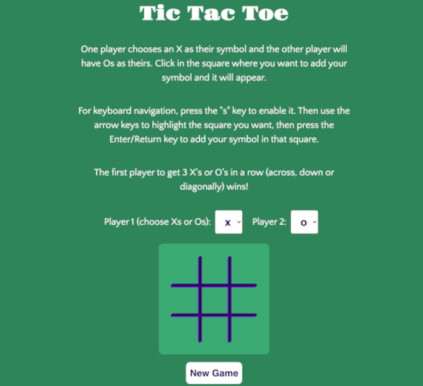
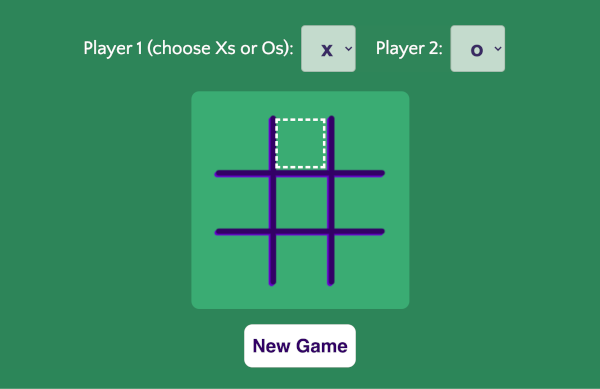
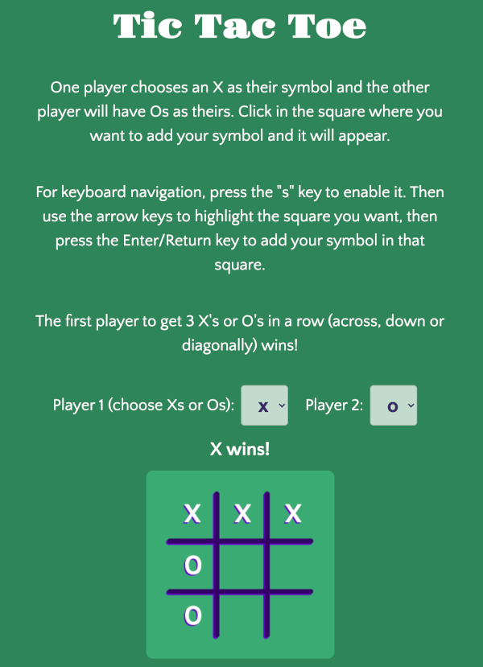

# Tic Tac Toe

Live App

<https://amypepper.github.io/tic-tac-toe>

## Screenshots

Landing page

Keyboard Navigation

Win Scenario

## Summary

The board is drawn using the HTML5 \`canvas\` element and made interactive using only vanilla Javascript. It is fully
keyboard-navigable and notifies users of errors as well as when the
game has ended.

To play, players click in the square where they want to play their
symbol and it appears. For keyboard navigation, players press the "s"
key to enable it. Then they use the arrow keys to highlight the square
they want, and press the Enter/Return key to play their symbol.

When a player gets 3 X's or O's in a row (across, down or diagonally), the app informs them who has won.

## Technologies Used

- Javascript
- HTML
- CSS
